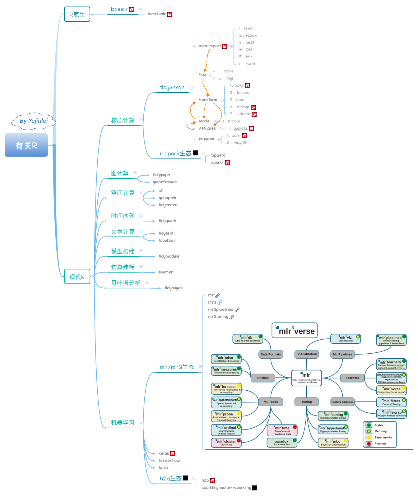

##  统计学习/机器学习(R语言版)

---

### 参考资料
1. [An Introduction to R](https://cran.r-project.org/doc/manuals/r-release/R-intro.html)

2. [The Big R-Book](https://share.weiyun.com/h9Z4VxFx)

3. [rstudio cheatsheets](https://rstudio.com/resources/cheatsheets/), [github](https://gitee.com/yejinlei-mirror/rstudio-cheatsheets)

4. [R for Data Science](https://r4ds.had.co.nz/index.html)

5. [ggplot2: Elegant Graphics for Data Analysis](https://ggplot2-book.org/index.html)

6. [Machine Learning with R, tidyverse, and mlr](https://share.weiyun.com/X4XRMj6A)

7. [Geocomputation with R](https://geocompr.robinlovelace.net/)

8. [Text Mining with R: A Tidy Approach](https://www.tidytextmining.com/index.html)

9. [Mastering Spark with R](https://therinspark.com/)

10. [R extensions, tools and resources for Apache Spark](https://github.com/r-spark)

11. [Applied Predictive Modeling](http://appliedpredictivemodeling.com/)

12. [Introduction to Machine Learning (I2ML)](https://introduction-to-machine-learning.netlify.app/)、[content](https://compstat-lmu.github.io/lecture_i2ml/articles/content.html)、[github](https://github.com/compstat-lmu/lecture_i2ml)

13. [R语言教程](https://www.math.pku.edu.cn/teachers/lidf/docs/Rbook/html/_Rbook/index.html)

14. [An Introduction to Statistical Learning with Applications in R](https://statlearning.com/)（统计学习导论：基于 R 应用）, 简称**ISLR**(频率派), [Donwload](https://statlearning.com/ISLR%20Seventh%20Printing.pdf), [R code](https://statlearning.com/All%20Labs.txt), [Python code](https://github.com/hardikkamboj/An-Introduction-to-Statistical-Learning), [nbviewer](https://nbviewer.jupyter.org/github/hardikkamboj/An-Introduction-to-Statistical-Learning/tree/master/), [配套视频](https://www.bilibili.com/video/av60874013/)

15. [The Elements of Statistical Learning](https://web.stanford.edu/~hastie/ElemStatLearn/), 简称**ESL**(频率派)

16. [Pattern Recognition and Machine Learning](https://www.microsoft.com/en-us/research/people/cmbishop/prml-book/), 简称**RPML**(贝叶斯派)

17. cheatsheets list
	* [rstudio's cheatsheets](https://rstudio.com/resources/cheatsheets/)
* [ggplot2中文](https://github.com/rstudio/cheatsheets/raw/master/translations/chinese/data-visualization-2.1.pdf)
    * [sparklyr中文](https://github.com/rstudio/cheatsheets/raw/master/translations/chinese/sparklyr-cheatsheet_zh_CN.pdf)
    
    

