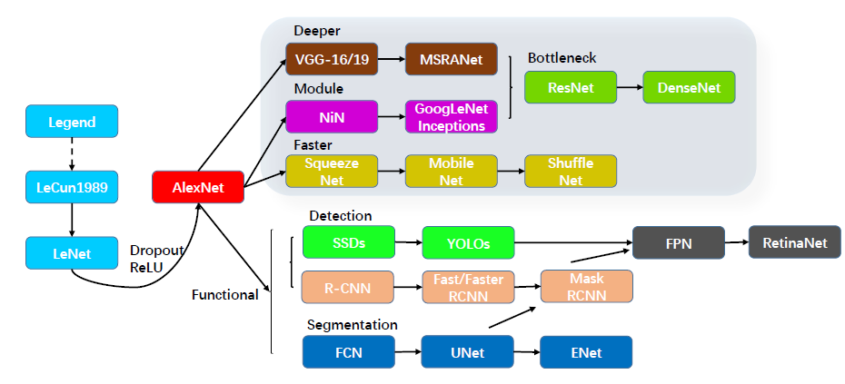
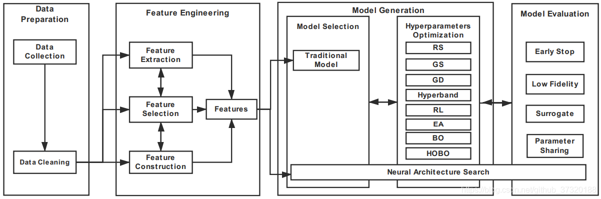
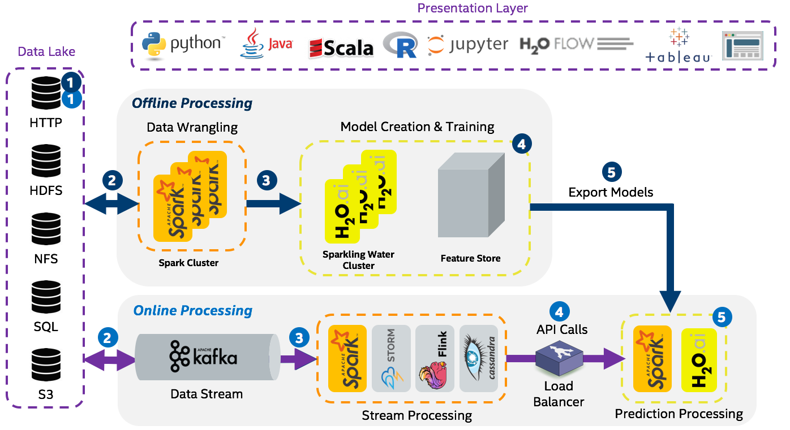

# about-ml 有关机器学习[【github】](https://github.com/yejinlei/about-ml)[【gitee】](https://gitee.com/yejinlei-co/about-ml)

----------

## 一、数学基础

数学知识点汇总

微积分

线性代数

概率论和统计学

- 统计数据的展示

	

- 概率与统计思维导图

    

- 基本概率分布

     [Univariate Distribution Relationships](http://www.math.wm.edu/~leemis/chart/UDR/UDR.html)

最优化

## 机器学习分类

有监督学习

无监督学习

强化学习

 

深度学习

迁移学习

元学习

## 面向领域

图像处理领域

自然语言领域

语音识别领域

## 机器学习ML

机器学习算法关系图

机器学习思维导图

## 深度学习DL

深度学习知识点汇总

深度网络模型发展方向

Deeper：网络层数更深，代表网络VggNet
Module：采用模块化的网络结构（Inception），代表网络GoogleNet
Faster：轻量级网络模型，适合于移动端设备，代表网络MobileNet和ShuffleNet
Functional：功能型网络，针对特定使用场景而发展出来。如检测模型YOLO，Faster RCNN；分割模型FCN，UNet

深度学习中的优化算法

## 自动化学习AutoML/AutoDL

1. > **AutoML as a CASH Problem**
   >
   > > **C**ombined **A**lgorithm **S**election and **H**yperparameter optimization

 

AutoML/AutoDL概览

 

---

 

  

2. **自动机器学习流程**
   1. 自动数据清洗
   2. 自动特征工程
   3. 自动数据建模(train->predict ->evaluate循环)
      1. 自动算法选择

      2. 自动超参数优化

         <!--与模型参数相比，超参数是由机器学习工程师在训练之前设置的。随机森林中的树数量是超参数，而神经网络中的权重是训练期间学习的模型参数。-->

         - 网格搜索(Gird Search)

         - 随机搜索(Random Search)

         - 基于贝叶斯优化(启发式), 目前主要使用基于序列模型的优化(SMBO, Sequential Model-Based Global Optimization), 常见三种:

           > 通过评估过去结果看起来更有希望的超参数，贝叶斯方法可以在较少的迭代中找到比随机搜索更好的模型设置。基于贝叶斯模型的优化的整个概念是通过仅选择最有希望的超参数集来基于先前对评估函数的调用来减少目标函数需要运行的次数。基于称为代理项的目标函数的模型来选择下一组超参数。
           >
           
             - 基于高斯过程回归代理的序列超参优化(GPR, Gaussian Process Regression), 以;
             - 基于随机森林回归代理的序列模型算法配置(SMAC), 以Autosklearn为代表;
             - 基于树结构Parzen估计器算法代理(TPE, Tree Parzen Estimator), 以Hyperopt为代表;
           
         - 基于进化的优化方法
         
         - 基于强化的优化方法
         
      3. 自动模型评估
      
         1. 模型度量
      
   4. 模型解释
   
3. **自动深度学习流程**
   
    1. 数据自动增强
    2. 网络模型自动优化
        - 超参数自动搜索
        - 网络结构搜索（NAS，基于强化学习、进化算法、可微分架构）
          - 归一化自动学习和配置
          - 激活函数自动学习和配置
          - 损失函数自动学习和配置
        - 网络模型自动剪枝
        - 网络模型自动压缩/蒸馏
3. 网络模型量化
   
4. **开源库评估**

  简介|库、框架|核心组件及函数|使用与评估
  ---|---|---|---
  _|hyperparameter_hunter [github](https://github.com/HunterMcGushion/hyperparameter_hunter/tree/v3.0.0)||
  _|automl_gs [github](https://github.com/minimaxir/automl-gs)、[tutorial](https://github.com/minimaxir/automl-gs/blob/master/docs/automl_gs_tutorial.ipynb)、[exampes](https://github.com/minimaxir/automl-gs-examples)|[**automl_grid_search**网格搜索策略](https://github.com/minimaxir/automl-gs/automl_gs/blob/master/automl_gs.py): step1:**get_problem_config**，从[评估指标模板](https://github.com/minimaxir/automl-gs/blob/master/automl_gs/metrics.yml)中获取学习类型及指标； step2:**build_hp_grid函数**，使用[超参数模板](https://github.com/minimaxir/automl-gs/blob/master/automl_gs/hyperparameters.yml)构建所有**超参数**； step3:**render_model函数**，在script目录下的[model模型模板](https://github.com/minimaxir/automl-gs/blob/master/automl_gs/templates/scripts/model)和[pipeline函数模板](https://github.com/minimaxir/automl-gs/blob/master/automl_gs/templates/scripts/pipeline)中填入超参数，生成可执行的脚本； step4:**train_generated_model函数**，训练模型； step5:显示结果|
   _ |auto-sklearn [github](https://github.com/automl/auto-sklearn)、[doc](https://automl.github.io/auto-sklearn/master/)、[论文](https://proceedings.neurips.cc/paper/2015/file/11d0e6287202fced83f79975ec59a3a6-Paper.pdf)|  |
  _ |h2o-3 [github](https://github.com/h2oai/h2o-3)、[doc](http://docs.h2o.ai/h2o/latest-stable/h2o-docs/index.html)|

h2o on spark

 |
  _ |bigdl/analytics-zoo/rayonspark [github](https://github.com/intel-analytics/analytics-zoo/tree/master/pyzoo/zoo/automl)|

ray on spark

 |
  _ | autokeras [github](https://github.com/keras-team/autokeras)||
  _ | Auto-PyTorch [github](https://github.com/automl/Auto-PyTorch)||
  _ | nni [github](https://github.com/Microsoft/nni.git)、[doc](https://github.com/microsoft/nni/blob/master/README_zh_CN.md)||

## 参考资料

- 文档
  - [scikit-learn (sklearn) 官方文档中文版](https://sklearn.apachecn.org/)
  - [H2O.ai文档](http://docs.h2o.ai/h2o/latest-stable/h2o-docs/index.html)

- 论文
  - 元学习
    - [floodsung/Meta-Learning-Papers](https://github.com/floodsung/Meta-Learning-Papers)

- 文章
  - [An Overview of AutoML Libraries Used in Industry](https://www.shangyexinzhi.com/article/313707.html)
  - [自动机器学习：最近进展研究综述](https://www.leiphone.com/news/201908/cM4vkvgmXinZ1Cky.htmlhttps://baijiahao.baidu.com/s?id=1641540911794101828&wfr=spider&for=pc)
  - [机器学习平台建设](https://blog.csdn.net/SoftwareTeacher/article/details/82692184)
  - [使用 Hyperopt 进行参数调优（译）](https://www.jianshu.com/p/35eed1567463)
  - [如何学习AutoML在模型优化中的应用](https://zhuanlan.zhihu.com/p/150455253)
  - [归一化激活层的进化：谷歌Quoc Le等人利用AutoML 技术发现新型ML模块](https://www.cnblogs.com/cx2016/p/12955409.html)
  - [论文解读: Auto HAS - 结合超参数搜索和NAS](https://zhuanlan.zhihu.com/p/149888426?from_voters_page=true)