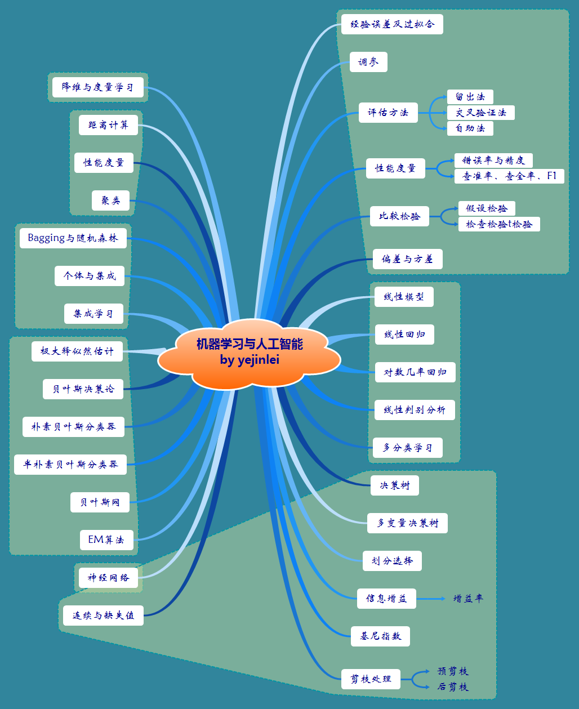
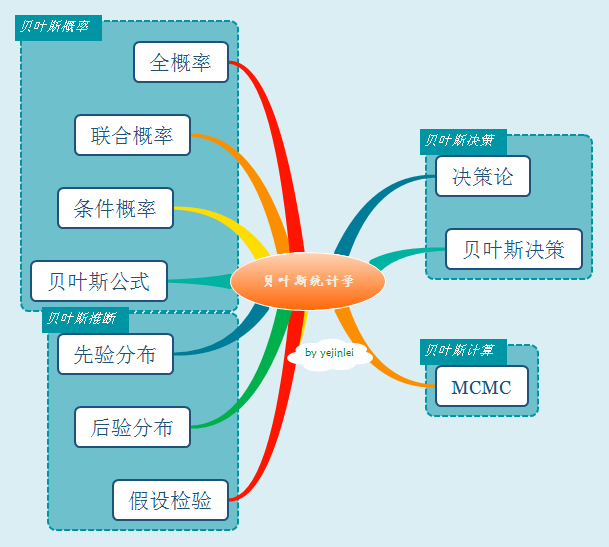

# about-ml 有关机器学习

----------

## 数学基础

## 机器学习

## 深度学习

----------

## 微积分

## 线性代数

## 统计学

## 运筹学（operations Research，简称OP）及最优化
*1. 一般的运筹学模型，可以使用下面通用格式：*

    max或min 目标函数
    s.t.	 约束条件
*一个模型的解如果满足所有的约束条件，则称它是可行的(feasible);同时目标函数取得了最大或最小值，则称它是最优的(optimal)* 

*2. 运筹学的主要步骤：*
	
- 问题定义
- 模型构造
- 模型求解
- 模型验证
- 方案实施 

*3. 没有万能的数学模型可以描述现实中所有问题，同样也没有万能技术、方法可以求解所有数学模型；*

*4. 运筹学的的一个特点就是，问题的解往往不是通过解析式获得，而是利用某些算法或迭代计算，逐步逼近最优解的过程；*

*5. 计算量往往会随着模型复杂度而增加，有时为了减少计算量而简化数学模型来获得次优解*

### **线性规划**（linear programming，简称LP）★
*1. LP问题，带有线性目标函数和线性约束函数的模型*

*2. LP的最优解，总是发生在角点处，这意味着最优解能够简单通过枚举所有角点来找到；随着约束条件和变量的增加，角点个数也在增加，计算量会逐渐变大；*

##### 1、图解法（graphical method）
- 可行解空间的确定；
- 从可行解空间所有可行点中确定最优解；

##### 2、单纯形法（simplex method）

----------

## 传统机器学习

### 有监督学习

### 回归

### 分类

### 无监督学习

#### 降维
##### 主成分分析法PCA
1. 数据标准化

	`为什么要标准化？`

	`如何标准化？`

2. 通过svd分解成特征矩阵

3. 选择特征值

#### 聚类

----------

## 深度学习

----------

## 资料

