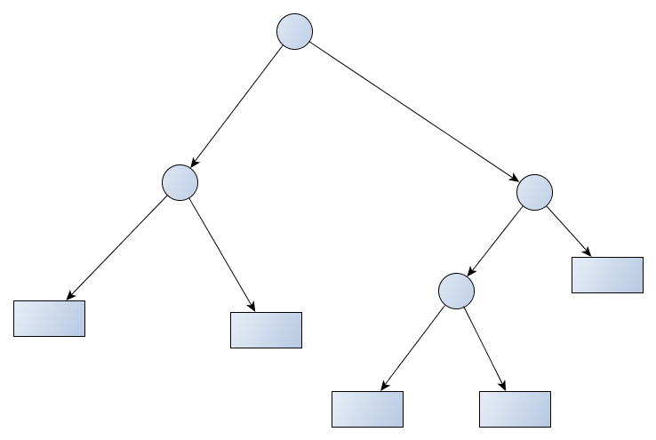

# about-ml 有关机器学习

----------

- *学习问题视为搜索问题，通过搜索策略和学习器探索搜索空间内在结构来刻画学习方法；学习定义：对于某类任务T和性能度量P，如果一个计算机程序在T上以P衡量的性能随着经验E而自我完善，那么我们称这个计算机程序在从经验E中学习 - 《机器学习》Tom M.Mitchell*

- *如果一个系统能够通过执行某个过程改进它的性能，这就是学习 - 赫尔伯特.西蒙*

- *统计学习是关于计算机基于数据构建概率统计模型并运用模型对数据进行预测与分析的一门学科，统计学习也称统计机器学习；按照赫尔伯特观点，统计学习就是计算机系统通过运用数据及统计方法提高系统性能的机器学习 - 《统计学习方法》李航*

##降维归约

    高纬数据会造成“维度灾难”，降维是一种对数据进行冗余删除和选择的预处理技术

- 特征选择 - 从d维中找出提供最多信息的k维数据，丢弃掉其他的（d-k）维数据
	- 筛选器，利用相关性删除冗余数据
	
		`说明：相关性，A和B可能同时被观测到，A发生时，B有可能同时发生; 因果性，A发生时必然导致B发生`

	- 封装器
- 特征提取 - 从d维中找出感兴趣的k个维度的组合数据
	- 主成分分析PCA，非监督，基于最小的特征值往往与噪声有关，线性降维
		1. 每个维度数据的中心化
	- 因子分析FA，

##线性模型（监督学习）

- **线性回归（LR）**
- **多元线性回归**
- **对数线性回归**
- **对数几率回归（分类，逻辑斯谛回归）**
- **线性判别分析（分类，LDA）**
- **感知机线性分类（PLA）**

##K近邻法

## 决策树
	决策树是一种基本的分类和回归方法
	呈树形结构
- 决策树模型 

	

	- if-then规则

		将决策树看成if-then的集合，从决策树的根节点到叶节点的每一条路径构建一条规则；
		内部节点（特征）对应着规则的条件（特征的值），叶节点对应规则的结论

	- 条件概率分布

		将决策时看成特征条件下的条件概率分布，这一条件概率分布定义在特征空间的一个划分上，

- 决策数学习步骤：

	1. 特征选择
	
		**g(D,A) = H(D) - H(D|A)**

		类Y总熵不变的情况下，选取特征的熵越大，从上述公式可知，信息增益取决于选取的特征

	2. 决策树的生成

	3. 决策树的剪枝

##关联规则

##聚类（无监督学习）

##神经网络

##支持向量机

##贝叶斯分类器

##集成学习

##强化学习

##数值优化算法
###迭代尺度法
###梯度下降
###牛顿法
###拟牛顿法